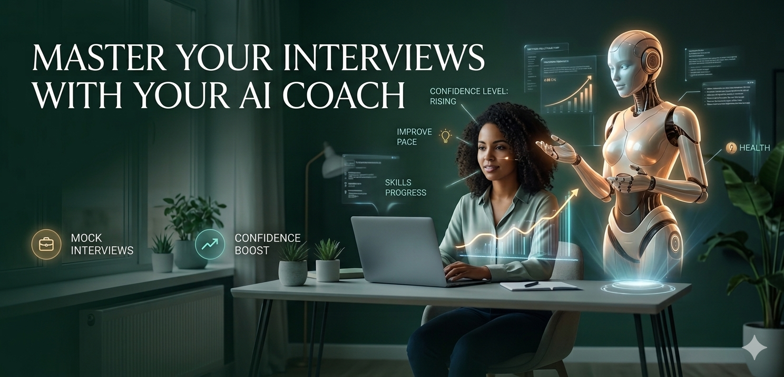

<div align="center">

# 🎙️ AI Interview Coach

### Practice interviews with a multi-agent AI system that conducts, analyzes, and coaches you in real-time.



[](https://ai-interview-coach-git-main-achyuthsilas-projects.vercel.app)
[](LICENSE)
[](#tech-stack)

---

**🔗 [Try the Live Demo](https://ai-interview-coach-git-main-achyuthsilas-projects.vercel.app)** • **📐 [Architecture](#architecture)** • **🛠️ [Tech Stack](#tech-stack)** • **⚡ [Quick Start](#quick-start)**

</div>

---

## 🎯 Overview

**AI Interview Coach** is a production-grade multi-agent AI system that simulates real interviews, analyzes your body language and voice in real time, and generates detailed personalized feedback. Built end-to-end as a full-stack engineering portfolio project.

Unlike typical "AI interview" chatbots, this app uses **four specialized AI agents working in parallel** — orchestrated by LangGraph — to deliver an experience that actually feels like a real interview.

> 💬 _"Most AI interview tools are just a chatbot with a microphone. I wanted to build something that feels like a real interview — and gives real feedback."_

---

## ✨ Features

- 🎙️ **Voice-First Interaction** — Speak naturally. AI speaks back. No buttons to press.
- 🤖 **Multi-Agent Architecture** — 4 specialized agents (Interviewer, Transcription, Evaluator, Coach) run in parallel
- 📄 **Resume + JD Personalization** — Upload your PDF resume; questions are tailored to your background and the job
- 🎭 **3 Interviewer Personas** — Friendly, Neutral, or Adversarial (stress mode)
- 📋 **5 Interview Types** — Screening, Behavioral, Technical/Coding, System Design, HR
- 👁️ **Real-Time Body Language Analysis** — Confidence, eye contact, stress level (runs locally in your browser — 100% private)
- 🎯 **Voice Analytics** — Filler word detection, speaking pace, volume tracking
- 📊 **Detailed Feedback Reports** — Per-question scoring, strengths, weaknesses, action items, and "better answer" examples
- 🧠 **95%+ Transcription Accuracy** — Even on technical terms like "Kubernetes", "RAG pipeline", "OAuth"
- 🚀 **Production-Deployed** — Vercel (frontend) + Hugging Face Spaces (backend) + Supabase (database)

---

## 🏗️ Architecture

┌─────────────────────┐
                │     Candidate       │
                │  Webcam · Mic · UI  │
                └──────────┬──────────┘
                           │
            ┌──────────────▼──────────────────┐
            │      FRONTEND (Vercel)          │
            │      Next.js · TypeScript       │
            │  ┌──────┐ ┌──────┐ ┌────────┐   │
            │  │Vision│ │Voice │ │  UI    │   │
            │  │ JS   │ │Capt. │ │ State  │   │
            │  └──────┘ └──────┘ └────────┘   │
            └──────────────┬──────────────────┘
                           │ HTTPS
            ┌──────────────▼──────────────────┐
            │   BACKEND (HF Spaces / Docker)  │
            │   FastAPI · Python · LangGraph  │
            │                                 │
            │      🟧 LangGraph Orchestrator  │
            │      ┌────┐  ┌────┐  ┌────┐     │
            │      │Intv│  │Whis│  │Eval│     │
            │      │vwer│  │per │  │uator│    │
            │      └────┘  └────┘  └────┘     │
            │           ┌────────┐            │
            │           │ Coach  │            │
            │           └────────┘            │
            └──────────────┬──────────────────┘
                           │
            ┌──────────────▼──────────────────┐
            │      DATABASE (Supabase)        │
            │  Sessions · Evals · Metrics     │
            └─────────────────────────────────┘

### The Four AI Agents

| Agent | Model | Role |
|---|---|---|
| 🎙️ **Interviewer** | Gemini 2.0 Flash | Generates personalized questions based on resume + JD |
| ✨ **Transcription** | Groq Whisper Large v3 | 95%+ accuracy STT with technical vocab biasing |
| 📊 **Evaluator** | Llama 3.3 70B (Groq) | Silently scores every answer in real-time |
| 🎯 **Coach** | Gemini 2.0 Flash | Generates final report with strengths, gaps, action items |

---

## 🛠️ Tech Stack

### Frontend
- **Framework:** Next.js 14 (App Router) + TypeScript + Tailwind CSS
- **Speech:** Web Speech API + Groq Whisper (hybrid for accuracy)
- **Vision:** face-api.js + MediaPipe (runs entirely client-side for privacy)
- **Audio Analysis:** Meyda.js (audio-level VAD)
- **State Management:** React hooks with custom state machines

### Backend
- **Framework:** FastAPI (Python 3.12)
- **AI Orchestration:** LangGraph + LangChain
- **LLM Providers:** Google Gemini, Groq (Llama 3.3, Whisper Large v3)
- **Validation:** Pydantic
- **Security:** slowapi rate limiting, input validation, CORS

### Database & Infrastructure
- **Database:** Supabase (PostgreSQL)
- **Frontend Hosting:** Vercel
- **Backend Hosting:** Hugging Face Spaces (Docker)
- **CI/CD:** GitHub Actions
- **Monitoring:** UptimeRobot

---

## 🚀 Live Demo

**🔗 Try it now:** [https://ai-interview-coach-git-main-achyuthsilas-projects.vercel.app](https://ai-interview-coach-git-main-achyuthsilas-projects.vercel.app)

> ⏱️ First request may take 20-30 seconds if the backend is sleeping. Subsequent requests are fast.

### How to Use

1. **Click "Start Practicing"**
2. **Upload your resume** (PDF) and paste a job description
3. **Choose** interview type and interviewer persona
4. **Allow** camera + microphone access
5. **Just talk** — no buttons to press. The AI listens, analyzes, and responds
6. **Get your detailed feedback report** at the end

---

## ⚡ Quick Start (Local Development)

### Prerequisites
- Node.js 20+
- Python 3.12+
- Free API keys from:
  - [Google AI Studio](https://aistudio.google.com) (Gemini)
  - [Groq Cloud](https://console.groq.com) (Whisper + Llama)
  - [Supabase](https://supabase.com) (Database)

### Setup

```bash
# Clone the repo
git clone https://github.com/Achyuth/ai-interview-coach.git
cd ai-interview-coach
```

### Backend

```bash
cd backend
python -m venv venv
venv\Scripts\activate          # Windows
# source venv/bin/activate     # Mac/Linux

pip install -r requirements.txt

# Create .env file with your API keys
echo "GEMINI_API_KEY=your_key" > .env
echo "GROQ_API_KEY=your_key" >> .env
echo "SUPABASE_URL=your_url" >> .env
echo "SUPABASE_KEY=your_key" >> .env

uvicorn main:app --reload --port 8000
```

### Frontend

```bash
cd frontend
npm install

# Create .env.local
echo "NEXT_PUBLIC_API_URL=http://localhost:8000" > .env.local

npm run dev
```

Open [http://localhost:3000](http://localhost:3000) 🚀

---

## 📁 Project Structure

ai-interview-coach/
├── frontend/                  # Next.js app
│   ├── src/
│   │   ├── app/              # Pages (home, setup, interview, report)
│   │   ├── components/       # WebcamPanel, MetricBar, etc.
│   │   ├── hooks/            # useSpeechRecognition, useVisionAnalysis, etc.
│   │   └── lib/              # config, API client
│   └── public/
│       ├── images/           # Hero image and assets
│       └── models/           # face-api.js model weights
│
├── backend/                   # FastAPI app
│   ├── agents/               # Multi-agent system
│   │   ├── interviewer.py    # Gemini-powered interviewer
│   │   ├── evaluator.py      # Groq Llama scorer
│   │   ├── coach.py          # Final report generator
│   │   └── orchestrator.py   # LangGraph coordinator
│   ├── database/             # Supabase client
│   ├── models/               # Pydantic schemas
│   ├── services/             # Whisper transcription
│   ├── main.py               # FastAPI entry point
│   └── Dockerfile            # For HF Spaces deployment
│
└── README.md


---

## 🔐 Privacy & Security

This project takes privacy seriously:

- ✅ **Webcam analysis runs 100% in your browser** — video never leaves your device
- ✅ **Only aggregated scores** (confidence %, eye contact %) sent to the server, not video
- ✅ **API keys stored as environment secrets** — never in code
- ✅ **Rate limiting** prevents abuse
- ✅ **GDPR-friendly architecture** by design
- ✅ **No tracking, no ads, no third-party data sharing**

---

## 🌟 What I Learned Building This

1. **Multi-agent isn't a buzzword** — splitting tasks across specialized agents (interviewer, evaluator, coach) genuinely outperforms one giant prompt.

2. **Web Speech API isn't enough for technical terms** — Switching to Groq Whisper jumped transcription accuracy from ~60% to 95%+ on terms like "Kubernetes" and "RAG pipeline".

3. **Audio-level VAD beats text-based VAD** — Using actual microphone energy to detect speech is far more reliable than waiting for transcription events.

4. **Free tier is enough** — Vercel + HF Spaces + Supabase + Gemini free tier + Groq free tier = real production app, $0/month operating cost.

5. **State machines beat ad-hoc logic** — The "wait → listen → speak → silence reset" flow during interviews required a proper state machine; complex enough to humble me.

6. **Privacy by architecture > privacy by policy** — Running face detection in the browser instead of sending video to a server changed the entire trust model of the app.

---

## 🗺️ Roadmap

- [ ] User authentication + session history dashboard
- [ ] Panel interview mode (3 AI interviewers with distinct personalities)
- [ ] Long-term memory — AI references your past weak areas across sessions
- [ ] Time-stamped video review with annotated coaching
- [ ] More interview styles (FAANG, consulting, MBA, sales)
- [ ] Group discussion simulator
- [ ] Salary negotiation practice

---

## 🤝 Contributing

This is a personal portfolio project, but I'd love feedback! Open an issue or DM me on LinkedIn.

If you find this useful, **⭐ star the repo** — it genuinely helps a lot for visibility.

---

## 📜 License

MIT License — see [LICENSE](LICENSE) for details. Feel free to fork and adapt for your own portfolio.

---

## 👨‍💻 About Me

Hi, I'm **Achyuth** — a software engineer focused on AI-powered full-stack applications.

I built this project end-to-end to demonstrate practical skills in agentic AI systems, multi-agent orchestration, real-time web apps, and production deployment.

**Currently open to roles in:**
- 🤖 AI / ML Engineering
- 💻 Full-Stack Engineering (TypeScript + Python)
- 🧠 Agentic AI / LangGraph / RAG systems

📫 **Get in touch:**
- 💼 [LinkedIn](https://www.linkedin.com/in/achyuthkumar09/)  
- 📧 achyuth.uf237@gmail.com 
- 🐙 [GitHub](https://github.com/achyuthsilas) 
---

<div align="center">

### Built with ❤️ and a lot of free-tier creativity.

**If this project helped you or sparked ideas, give it a ⭐ — it really helps!**

[](https://github.com/achyuthsilas/Ai-interview-coach)

</div>